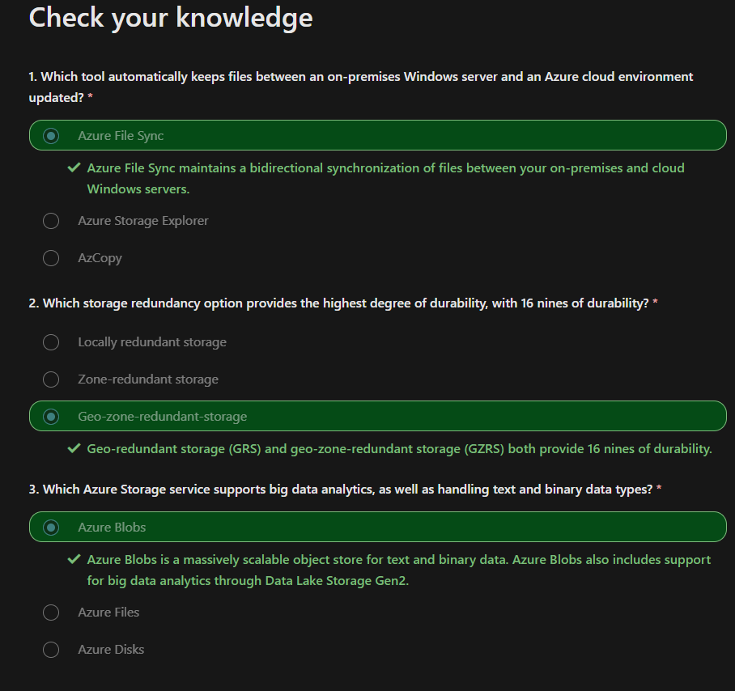
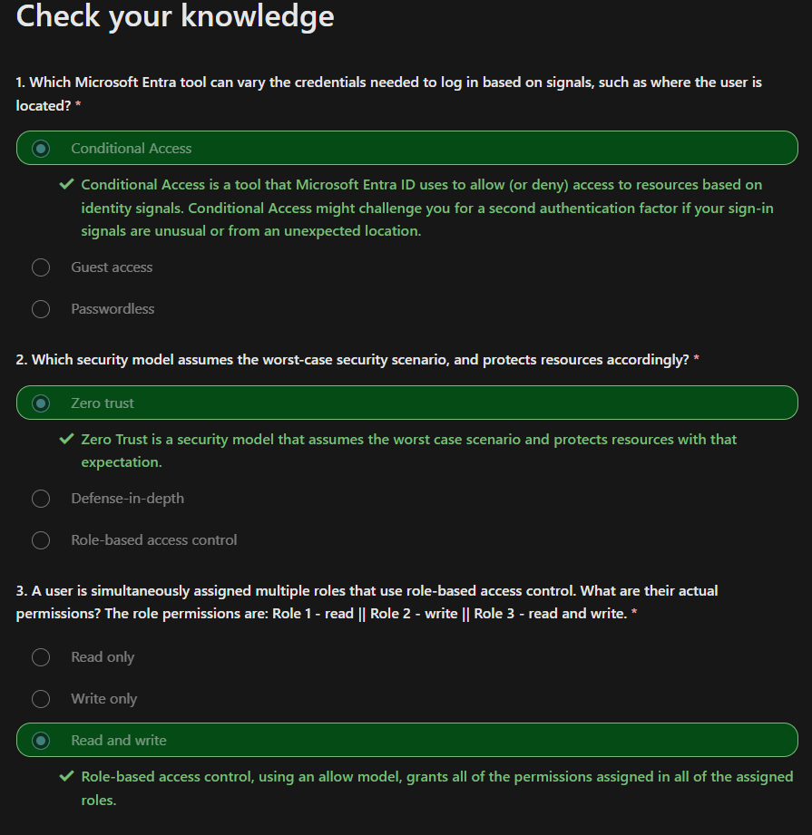
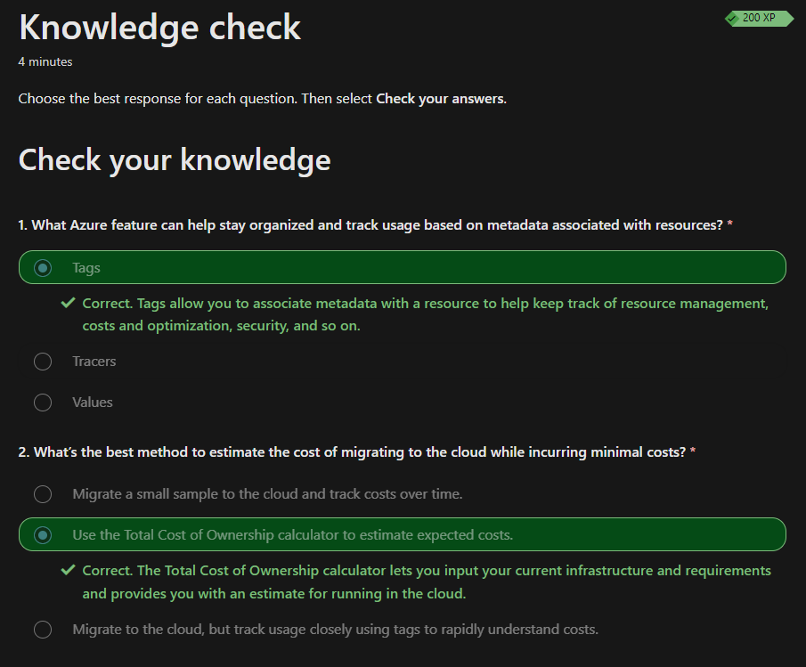
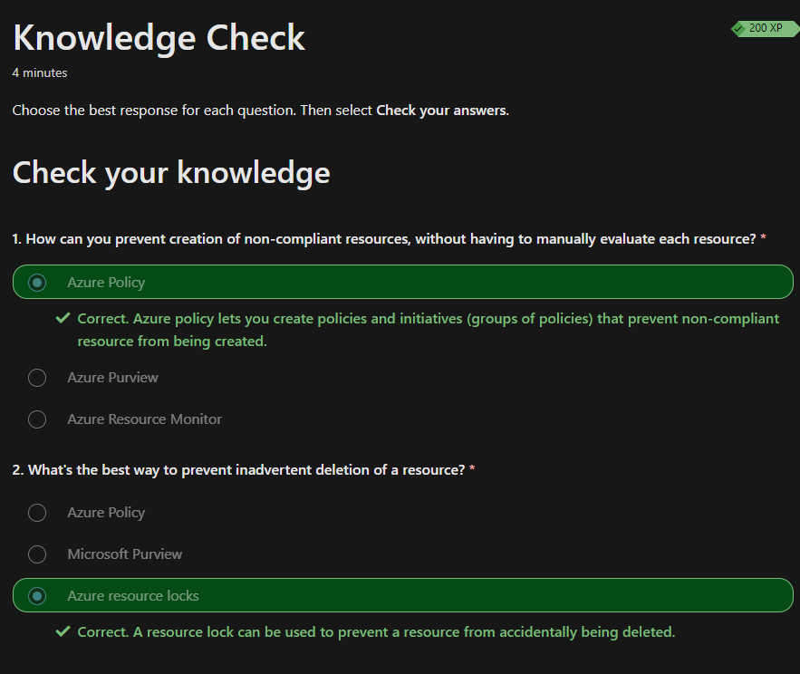

Notes and Resources for the AZ-900 certification.

*!Disclaimer!:*

*In the beginning i wrote the summarys myself. In order to safe time i switched to AI assisted note taking.*

# [Describe cloud concepts](https://learn.microsoft.com/en-us/training/paths/microsoft-azure-fundamentals-describe-cloud-concepts/)


## Describe cloud computing


### What is cloud computing?

Cloud computing is the delivery of computing services over the internet.


### What is the shared responsibility model

Customers are always responsible for:
- The information and data stored in the cloud
- Devices that are allowed to connect to your cloud
- The accounts and identities of the people, services, and devices within your organization

The cloud provider is always responsible for:
- The physical datacenter
- The physical network
- The physical hosts

Your service model will determine responsibility for things like:
- Operating systems
- Network controls
- Applications

This depends on the Type of Service:

|Type|Client Responsibility|
|-|-|
|**S**oftware **a**s **a** **S**ervice|Less|
|**P**latform **a**s **a** **S**ervice|Neutral|
|**I**nfrastructure **a**s **a** **S**ervice|More|


### Define cloud models


|Public cloud|Private cloud|Hybrid cloud|
|-|-|-|
No capital expenditures to scale up|Organizations have complete control over resources and security|Provides the most flexibility|
Applications can be quickly provisioned and deprovisioned|	Data is not collocated with other organizations’ data|	Organizations determine where to run their applications|
Organizations pay only for what they use|	Hardware must be purchased for startup and maintenance|	Organizations control security, compliance, or legal requirements|
Organizations don’t have complete control over resources and security|	Organizations are responsible for hardware maintenance and updates||

Multi-cloud:
- Multiple public cloud providers

Azure Arc:
- Set of technologies that helps manage the cloud environment.

Azure VMware Solution:
- Run your VMWare workloads in Azure


### Consumption based model
Capital Expenditure(CapEx):
- Typically one-time up-front payment
- E.g new datacenter

Operational Expenditure(OpEx):
- Spending money on services over time
- Leasing a company vehicle

Consumption-based model is OpEx

This consumption-based model has many benefits, including:

No upfront costs.
- No need to purchase and manage costly infrastructure that users might not use to its fullest potential.
- The ability to pay for more resources when they're needed.
- The ability to stop paying for resources that are no longer needed.

You typically pay only for the cloud services you use, which helps you:

- Plan and manage your operating costs.
- Run your infrastructure more efficiently.
- Scale as your business needs change.


## Describe the benefits of using cloud services

### High availability and scalability

#### Availability
- focuses on ensuring maximum availability
- Azure is highly available cloud environment
- Service Level Agreements define the availability

|Uptime|per Week|per Month|
|-|-|-|
|99%|1.6h|7.2h|
|99.9%|10min|43min|

--> SLAs should be selected accordingly

#### Scalability
Ability to adjust resources to meet demand. 
- Adding resources to match increasing demand
- No overpaying for services

**Vertical Scaling**
- scaling up by increasing the resources quality -> e.g more CPU or RAM
- scaling down by decreasing the resources quality

**Horizontal Scaling**
- scaling out -> Adding resources (More servers)
- scaling in -> Removing resources (Less servers)
- One can scale horizontally by simply increasing the number of resources

Scaling can happen manually or automatically to match demand.

### Benefits of reliability and predictability in the cloud

#### Reliability
- Ability to recover from failures and continue to function.
- The clouds decentralized design enables reliable and resilient infrastructure.
- Global scale helps in catastrophic events

#### Predictability 
Performance predictability and cost predictability helps building confidence

**Performance**
- Performance predictability focuses on predicting the resources needed to deliver a positive experience for your customers.
- Cloud features like Autoscaling, load balancing, high availability lead to performance predictability

**Cost**
- Cost predictability is focused on predicting or forecasting the cost of the cloud spend
- Real time tracking, Data Analysis, Total Cost of Ownership, Pricing Calculator

### Security and governance
**Governance and compliance**
- Cloud based auditing
- Templates
- Automatic Updates

**Security**
- Maximum control via IaaS
- Well suited to handle things like distributed denial of service (DDoS) attacks

### Manageability
Two types:

#### Management of the cloud
Management of the cloud speaks to managing your cloud resources. In the cloud, you can:
- Automatically scale resource deployment based on need.
- Deploy resources based on a preconfigured template, removing the need for manual configuration.
- Monitor the health of resources and automatically replace failing resources.
- Receive automatic alerts based on configured metrics, so you’re aware of performance in real time.

#### Management in the cloud
Management in the cloud speaks to how you’re able to manage your cloud environment and resources. You can manage these:

- Through a web portal.
- Using a command line interface.
- Using APIs.
- Using PowerShell.

## Cloud service Types

### Infrastructure as a Service

Infrastructure as a service (IaaS) is the most flexible category of cloud services, as it provides you the maximum amount of control for your cloud resources.

Refer to the shared responsibility model.

Some common scenarios where IaaS might make sense include:

- Lift-and-shift migration: You’re setting up cloud resources similar to your on-prem datacenter, and then simply moving the things running on-prem to running on the IaaS infrastructure.
- Testing and development: You have established configurations for development and test environments that you need to rapidly replicate. You can start up or shut down the different environments rapidly with an IaaS structure, while maintaining complete control.

### Platform as a Service
Platform as a service (PaaS) is a middle ground between renting space in a datacenter (infrastructure as a service) and paying for a complete and deployed solution (software as a service).
Refer to the shared responsibility model.

Some common scenarios where PaaS might make sense include:

- Development framework: PaaS provides a framework that developers can build upon to develop or customize cloud-based applications. Similar to the way you create an Excel macro, PaaS lets developers create applications using built-in software components. Cloud features such as scalability, high-availability, and multi-tenant capability are included, reducing the amount of coding that developers must do.
- Analytics or business intelligence: Tools provided as a service with PaaS allow organizations to analyze and mine their data, finding insights and patterns and predicting outcomes to improve forecasting, product design decisions, investment returns, and other business decisions.

### Software as a Service
Software as a service (SaaS) is the most complete cloud service model from a product perspective. With SaaS, you’re essentially renting or using a fully developed application. 

Some common scenarios for SaaS are:

- Email and messaging.
- Business productivity applications.
- Finance and expense tracking.

# [Describe Azure architecture and services](https://learn.microsoft.com/en-us/training/paths/azure-fundamentals-describe-azure-architecture-services/)
## Core architectural components of Azure
### What is MS Azure

Azure is Microsoft's cloud computing platform, a continually expanding set of cloud services that help you meet current and future business challenges.
- most services are pay as you go
- Azure provides IaaS, PaaS and SaaS
- Storage, VMs, Cloud Functions, Containerization, CosmosDB, Azure Machine Learning, Regional Datacenters
- AzurePortal for Resource Management

### Azure accounts 
To create and use Azure services, you need an Azure subscription.

If you're new to Azure, you can sign up for a free account on the Azure website to start exploring at no cost to you.

**Free Account**
The [Azure free account](https://azure.microsoft.com/free) includes:
- Free access to popular Azure products for 12months
- A credit to use for the first 30 days.
- Access to more than 25 products that are always free

**Learn Sandbox**
Many of the Learn exercises use a technology called the sandbox, which creates a temporary subscription that's added to your Azure account. 

### Explore the Learn Sandbox

Commands:

|Command|Result|
|-|-|
|az version|shows the version of the cli you are using|
|bash|switches to bash mode |
|az interactive|switches to interactive mode|
|az upgrade| upgrades the cli|

### Describe Azure physical infrastructure
#### Physical
Microsoft is providing Azure via multiple datacenters all around the world. 

The resources in the facilities are arranged in racks and have dedicated power, cooling and networking.

Datacenters are grouped into Azure Regions or Azure Availability zones that are designed to help you achieve resiliency and reliability for your business-critical workloads.

[Explore the physical infrastructure](https://datacenters.microsoft.com/globe/explore)

#### Region

A region is a geographical area on the planet that contains at least one, but potentially multiple datacenters that are nearby and networked together with a low-latency network. 

When you deploy a resource in Azure, you'll often need to choose the region where you want your resource deployed.

#### Availability Zones
Availability zones are physically separate datacenters within an Azure region. 

Each availability zone is made up of one or more datacenters equipped with independent power, cooling, and networking. An availability zone is set up to be an isolation boundary. If one zone goes down, the other continues working.


**To ensure resiliency, a minimum of three separate availability zones are present in all availability zone-enabled regions. However, not all Azure Regions currently support availability zones.**

Setting up own on premise redundancy requires duplicate hardware

Availability zones are primarily for VMs, managed disks, load balancers, and SQL databases. Azure services that support availability zones fall into three categories:

- Zonal services: You pin the resource to a specific zone (for example, VMs, managed disks, IP addresses).
- Zone-redundant services: The platform replicates automatically across zones (for example, zone-redundant storage, SQL Database).
- Non-regional services: Services are always available from Azure geographies and are resilient to zone-wide outages as well as region-wide outages.

Even with the additional resiliency that availability zones provide, it’s possible that an event could be so large that it impacts multiple availability zones in a single region. To provide even further resilience, Azure has Region Pairs.

#### Region Pairs
Most Azure regions are paired with another region within the same geography (such as US, Europe, or Asia) at least 300 miles away.


>Not all Azure services automatically replicate data or automatically fall back from a failed region to cross-replicate to another enabled region. In these scenarios, recovery and replication must be configured by the customer.Most regions are paired in two directions but one way pairing is possible.

Additional advantages:
- If an extensive Azure outage occurs, one region out of every pair is prioritized to make sure at least one is restored as quickly as possible for applications hosted in that region pair.
- Planned Azure updates are rolled out to paired regions one region at a time to minimize downtime and risk of application outage.
- Data continues to reside within the same geography as its pair (except for Brazil South) for tax- and law-enforcement jurisdiction purposes.

#### Sovereign Regions
Sovereign regions are instances of Azure that are isolated from the main instance of Azure. 

- US DoD Central, US Gov Virginia, US Gov Iowa and more: These regions are physical and logical network-isolated instances of Azure for U.S. government agencies and partners. These datacenters are operated by screened U.S. personnel and include additional compliance certifications.
- China East, China North, and more: These regions are available through a unique partnership between Microsoft and 21Vianet, whereby Microsoft doesn't directly maintain the datacenters.

### Describe Azure management infrastructure
#### Resource
A resource is the basic building block of Azure
- Anything you create, deploy, provision etc.
- E.g VMs, virtual networks, databases, cognitive services

#### Resource groups
Groupings of resources. 

- Resources have to be added to a resource group. 
- A single resource can only be in one resource group at a time
- Resource groups cant be nested

Resource groups provide a convenient way to group resources together.
- Applying an action to a group will apply the action to all the resources 

When you’re provisioning resources, it’s good to think about the resource group structure that best suits your needs.

There aren’t hard rules about how you use resource groups, so consider how to set up your resource groups to maximize their usefulness for you.

#### Azure subscriptions


**Using Azure requires an Azure subscription.**

Subscriptions are a unit of management, billing, and scale.

An Azure subscription links to an Azure account, which is an identity in Microsoft Entra ID or in a directory that Microsoft Entra ID trusts.

An account can have multiple subscriptions, but it’s only required to have one. In a multi-subscription account, you can use the subscriptions to configure different billing models and apply different access-management policies.

Azure subscriptions can be used to define boundaries:
- Billing boundary: 
This subscription type determines how an Azure account dis billed for using Azure. Separate billing reports and invoices are being generated for each subscription.
- Access control boundary: 
Azure applies access-management policies at the subscription level. You can create separate subscriptions to reflect organizational structures.

**Create additional Azure subscriptions**
With additional subscriptions you can separate:
- Environments
- Organizational structures
- Billing

#### Azure management groups
This is the scope above subscriptions.
Can be used to manage subscriptions accounting for access, policies and compliance.


Important facts about management groups:

- 10,000 management groups can be supported in a single directory.
- A management group tree can support up to six levels of depth. This limit doesn't include the root level or the subscription level.
- Each management group and subscription can support only one parent.

### Exercise Create an Azure resource
[created a ressource](https://learn.microsoft.com/en-us/training/modules/describe-core-architectural-components-of-azure/7-exercise-create-azure-resource)
### Knowledge check

## Azure compute and networking services
### Virtual Machines
**Use Cases:**
  - Full control over OS.
  - Run custom software.
  - Custom hosting configurations.
  - Rapid VM provisioning with preconfigured images.

**Scaling:**
  - Run single or grouped VMs.
  - Scale sets: manage identical, load-balanced VMs.
  - Availability sets: ensure high availability and resilience.

**Virtual Machine Scale Sets:**
  - Automate configuration, scaling, and updates.
  - Adjust VM instances based on demand.
  - Load balancing included.

**Virtual Machine Availability Sets:**
  - Ensure varied updates and power/network connectivity.
  - Group VMs by update and fault domains.
  - No additional cost for configuring.

**Common Examples:**
  - Testing and development.
  - Running cloud applications.
  - Extending datacenter to the cloud.
  - Disaster recovery.

**Move to the Cloud:**
  - Lift and shift physical servers to VMs.
  - Maintain VM OS and software.

**Resource Selection:**
  - Size (cores, RAM).
  - Storage disks.
  - Networking (virtual network, public IP, ports).

### Exercise Create an Azure virtual machine
[link](https://learn.microsoft.com/en-us/training/modules/describe-azure-compute-networking-services/3-exercise-create-azure-virtual-machine)

```
Create LinuxVM:
az vm create \
  --resource-group "learn-f05739ba-066e-4e65-984b-a7ac1d4ef706" \
  --name my-vm \
  --public-ip-sku Standard \
  --image Ubuntu2204 \
  --admin-username azureuser \
  --generate-ssh-keys   
```

```
Configure Nginx:
az vm extension set \
  --resource-group "learn-f05739ba-066e-4e65-984b-a7ac1d4ef706" \
  --vm-name my-vm \
  --name customScript \
  --publisher Microsoft.Azure.Extensions \
  --version 2.1 \
  --settings '{"fileUris":["https://raw.githubusercontent.com/MicrosoftDocs/mslearn-welcome-to-azure/master/configure-nginx.sh"]}' \
  --protected-settings '{"commandToExecute": "./configure-nginx.sh"}'    
```
### Azure Virtual Desktop
**Overview:**
  - Desktop and application virtualization service on the cloud.
  - Access cloud-hosted Windows from any location.
  - Compatible with various devices, operating systems, and modern browsers.

**Security:**
  - Centralized security management with Microsoft Entra ID.
  - Multifactor authentication for secure sign-ins.
  - Granular role-based access controls (RBACs).
  - Data and apps run in the cloud, reducing the risk of data on personal devices.
  - Isolated user sessions in both single and multi-session environments.

**Multi-Session Windows Deployment:**
  - Use Windows 10 or Windows 11 Enterprise multi-session.
  - Multiple concurrent users on a single VM.
  - Consistent experience with broader application support compared to Windows Server-based OS.

### Azure Containers
TODO: Link to containerization
- **Containers:**
  - Virtualization environment for running multiple instances on a single host.
  - No need to manage the operating system.
  - Lightweight, agile, and designed for dynamic scaling.
  - Quick to restart after crashes or interruptions.
  - Popular container engine: Docker (supported by Azure).

**Azure Container Instances:**
  - Fastest and simplest way to run a container in Azure.
  - No need to manage virtual machines or additional services.
  - Platform as a service (PaaS) offering.
  - Upload and run containers easily.

**Azure Container Apps:**
  - Similar to container instances with added benefits.
  - Load balancing and scaling capabilities.
  - More elastic design.

**Azure Kubernetes Service (AKS):**
  - Container orchestration service.
  - Manages the lifecycle of containers.
  - Simplifies management of a fleet of containers.

**Use Containers in Solutions:**
  - Often used in microservice architecture.
  - Break solutions into smaller, independent pieces.
  - Example: Split a website into separate containers for front end, back end, and storage.
  - Allows independent scaling, maintenance, and updates.
  - Scale specific parts (e.g., back end) as needed without affecting others.

### Azure Functions
TODO: Link to serverless approach

**Overview:**
  - Event-driven, serverless compute option.
  - No need to maintain virtual machines or containers.
  - Functions are triggered by events, eliminating the need for always-on resources.

**Benefits of Azure Functions:**
  - Focus on code, not the underlying infrastructure.
  - Ideal for quick tasks triggered by events, timers, or messages from other services.
  - Automatically scales based on demand.
  - Only charged for CPU time used while functions run. (Event driven)
  - Supports stateless (default) and stateful (Durable Functions) modes.
  - Stateless: Functions restart with each event.
  - Stateful: Track activity with context passed through functions.
  - General compute platform for any type of code.
  - Flexible deployment options: serverless, virtual networks, or isolated environments.

### Application hosting options

**Virtual Machines (VMs):**
  - Maximum control over the hosting environment.
  - Familiar hosting method for those new to the cloud.

**Containers:**
  - Isolate and manage different aspects of the hosting solution.
  - Robust and flexible hosting option.

**Azure App Service:**

  - **Overview:**
    - Build and host web apps, background jobs, mobile back-ends, and RESTful APIs.
    - No need to manage infrastructure.
    - Automatic scaling and high availability.
    - Supports Windows and Linux.
    - Automated deployments from GitHub, Azure DevOps, or any Git repo.
    - Focus on app development while Azure manages the environment.

  - **Supported Languages:**
    - .NET, .NET Core, Java, Ruby, Node.js, PHP, Python.
    - Supports both Windows and Linux environments.

  - **Types of App Services:**
    - **Web Apps:**
      - Full support for hosting using various languages.
      - Choice of Windows or Linux as the host OS.
    - **API Apps:**
      - Build REST-based web APIs.
      - Full Swagger support.
      - Package and publish APIs in Azure Marketplace.
      - Consumable by any HTTP- or HTTPS-based client.
    - **WebJobs:**
      - Run programs or scripts in the same context as web, API, or mobile apps.
      - Scheduled or triggered runs.
      - Ideal for background tasks.
    - **Mobile Apps:**
      - Quickly build back ends for iOS and Android apps.
      - Store data in cloud-based SQL database.
      - Authenticate customers with social providers (MSA, Google, Twitter, Facebook).
      - Send push notifications.
      - Execute custom back-end logic.
      - SDK support for native iOS, Android, Xamarin, and React native apps.

**Infrastructure Management:**
    - Integrated deployment and management.
    - Secured endpoints.
    - Quick scaling to handle high traffic.
    - Built-in load balancing and traffic management for high availability.
    - Shared infrastructure benefits for all app styles.

**Azure App Service Benefits:**
  - Ideal for hosting web-oriented applications.
  - Flexible and scalable hosting option.

### Azure virtual networks and subnets
**Overview:**
  - Enable Azure resources (VMs, web apps, databases) to communicate with each other, the internet, and on-premises client computers.
  - Act as an extension of on-premises networks.

**Key Networking Capabilities:**
  - **Isolation and Segmentation:**
    - Create multiple isolated virtual networks.
    - Define private IP address spaces (public/private IP ranges).
    - Subdivide address spaces into named subnets.
    - Built-in name resolution service or use internal/external DNS servers.
  - **Internet Communications:**
    - Incoming connections via public IP addresses or public load balancers.
  - **Communicate Between Azure Resources:**
    - Connect VMs and other Azure resources (App Service Environment, Azure Kubernetes Service, Azure VM scale sets).
    - Use service endpoints to link Azure resources like SQL databases and storage accounts for improved security and routing.
  - **Communicate with On-Premises Resources:**
    - **Point-to-Site VPN:**
      - Computer outside organization to corporate network (encrypted VPN connection).
    - **Site-to-Site VPN:**
      - On-premises VPN device/gateway to Azure VPN gateway (encrypted connection over the internet).
    - **Azure ExpressRoute:**
      - Dedicated private connectivity to Azure, bypassing the internet (higher bandwidth and security).
  - **Route Network Traffic:**
    - Default traffic routing between subnets, virtual networks, on-premises networks, and the internet.
    - Custom route tables and Border Gateway Protocol (BGP) for custom routing.
  - **Filter Network Traffic:**
    - **Network Security Groups (NSGs):**
      - Define rules to allow/block traffic based on IP address, port, and protocol.
    - **Network Virtual Appliances (NVAs):**
      - Specialized VMs for specific network functions (firewalls, WAN optimization).
  - **Connect Virtual Networks:**
    - **Virtual Network Peering:**
      - Connect two virtual networks privately over the Microsoft backbone network.
      - Enables inter-region communication for a global interconnected network.
    - **User-Defined Routes (UDRs):**
      - Control routing tables between subnets/virtual networks for greater traffic flow control.

**Endpoint Types:**
- **Public Endpoints:**
  - Public IP addresses accessible worldwide.
- **Private Endpoints:**
  - Private IP addresses within a virtual network's address space.

#### Exercise: Configure network access
[Link](https://learn.microsoft.com/en-us/training/modules/describe-azure-compute-networking-services/9-exercise-configure-network-access)
### Exercise - Configure Network Access

**Overview:**
- Configure access to a previously created VM.
- Ensure the VM is running with `az vm list`.

**Tasks:**

1. **Access Your Web Server:**
   - Get the VM's IP address:
     ```bash
     IPADDRESS="$(az vm list-ip-addresses --resource-group "learn-f05739ba-066e-4e65-984b-a7ac1d4ef706" --name my-vm --query "[].virtualMachine.network.publicIpAddresses[*].ipAddress" --output tsv)"
     ```
   - Test connection to the web server:
     ```bash
     curl --connect-timeout 5 http://$IPADDRESS
     ```
   - If the connection times out, print the IP address:
     ```bash
     echo $IPADDRESS
     ```
   - Attempt to access the web server from a browser.

2. **List Current network security group Rules:**
   - List the NSGs associated with the VM:
     ```bash
     az network nsg list --resource-group "learn-f05739ba-066e-4e65-984b-a7ac1d4ef706" --query '[].name' --output tsv
     ```
   - List the rules in the NSG:
     ```bash
     az network nsg rule list --resource-group "learn-f05739ba-066e-4e65-984b-a7ac1d4ef706" --nsg-name my-vmNSG --query '[].{Name:name, Priority:priority, Port:destinationPortRange, Access:access}' --output table
     ```

3. **Create Network Security Rule:**
   - Create a rule to allow inbound HTTP access on port 80:
     ```bash
     az network nsg rule create --resource-group "learn-f05739ba-066e-4e65-984b-a7ac1d4ef706" --nsg-name my-vmNSG --name allow-http --protocol tcp --priority 100 --destination-port-range 80 --access Allow
     ```
   - Verify the new rule:
     ```bash
     az network nsg rule list --resource-group "learn-f05739ba-066e-4e65-984b-a7ac1d4ef706" --nsg-name my-vmNSG --query '[].{Name:name, Priority:priority, Port:destinationPortRange, Access:access}' --output table
     ```

4. **Access Your Web Server Again:**
   - Retry accessing the web server:
     ```bash
     curl --connect-timeout 5 http://$IPADDRESS
     ```

**Optional Steps:**
- Refresh your browser to check the web server's home page.

**Clean Up:**
- The sandbox automatically cleans up resources after the module.
- For your own subscription, delete unnecessary resources to avoid costs.

**Next Unit:**
- Describe Azure Virtual Private Networks.

### Virtual Private Network (VPN)

**Overview:**
- Encrypted tunnel within a network for secure communication.
- Typically connects trusted private networks over an untrusted network (e.g., public internet).

**VPN Gateways:**
- Type of virtual network gateway in Azure.
- Enables various connectivity options:
  - Site-to-site connection to on-premises datacenters.
  - Point-to-site connection for individual devices.
  - Network-to-network connection between virtual networks.
- Data transfer encrypted within private tunnels.
- Only one VPN gateway per virtual network.
- Authentication method: pre-shared key.

**Policy-based vs. Route-based VPN:**
- Policy-based: Specifies IP addresses for encryption.
- Route-based: Tunnels modeled as network interfaces, preferred for on-premises devices.

**High Availability:**
- **Active/Standby:** Default configuration with automatic failover.
- **Active/Active:** Support for BGP routing protocol, assigns unique IP addresses.
- **ExpressRoute Failover:** VPN gateway as a failover path for ExpressRoute connections.
- **Zone-Redundant Gateways:** Deployed in Azure availability zones for resiliency.

### Azure ExpressRoute

**Overview:**
- Extends on-premises networks to Microsoft cloud via private connection, direct connection, no traffic over public internet
- Connection facilitated through ExpressRoute Circuit.
- Direct access to Microsoft cloud services like Azure and Microsoft 365.

**Connectivity Options:**
- Any-to-any (IP VPN), point-to-point Ethernet, or virtual cross-connection.
- Connections bypass public internet for enhanced reliability, speed, latency, and security.

**Features and Benefits:**
- **Connectivity to Microsoft Cloud:**
  - Access to various Microsoft services across all regions.
  - Global connectivity with ExpressRoute Global Reach.
- **Dynamic Routing:**
  - Utilizes Border Gateway Protocol (BGP) for route exchange.
- **Built-in Redundancy:**
  - Redundant devices at peering locations for reliability.

**Connectivity Models:**
1. **CloudExchange Colocation:**
   - Co-located at cloud exchange, request virtual cross-connect.
2. **Point-to-Point Ethernet Connection:**
   - Direct point-to-point connection to Microsoft cloud.
3. **Any-to-Any Networks:**
   - Integrates WAN with Azure for office and datacenter connections.
4. **Directly from ExpressRoute Sites:**
   - Connects directly to Microsoft's global network at peering locations.

**Security Considerations:**
- Data doesn't traverse public internet, enhancing security.
- Private connection from on-premises to Azure.
- Some communications (e.g., DNS queries) still go over public internet.

### Azure DNS

**Overview:**
- Hosting service for DNS domains using Microsoft Azure infrastructure.
- Manages DNS records with Azure credentials, APIs, tools, and billing.

**Benefits:**
1. **Reliability and Performance:**
   - Hosted on Azure's global network of DNS name servers.
   - Anycast networking for fast performance and high availability.
2. **Security:**
   - Utilizes Azure Resource Manager features like role-based access control and activity logs.
   - Resource locking to prevent accidental deletion or modification of critical resources.
3. **Ease of Use:**
   - Integrated into Azure portal with consistent credentials, support, and billing.
   - Management via Azure portal, PowerShell cmdlets, Azure CLI, REST API, and SDKs.
4. **Customizable Virtual Networks:**
   - Supports private DNS domains for custom domain names in private virtual networks.
5. **Alias Records:**
   - Supports alias record sets to refer to Azure resources like public IP addresses, Traffic Manager profiles, or CDN endpoints.
   - Automatically updates during DNS resolution if underlying resource IP address changes.

**Important Note:**
- Azure DNS does not provide domain name purchasing; use App Service domains or third-party registrars for domain name acquisition.
### Knowlede check

### Additional resources
Additional resources
The following additional resources are intended to provide more information on topics in this module or on additional topics related to this module.

- [Host a web application with Azure App Service](https://learn.microsoft.com/en-us/learn/modules/host-a-web-app-with-azure-app-service/) is a Microsoft Learn module that explores the process of hosting a web application in Azure.
- [Introduction to Azure network foundation services](https://learn.microsoft.com/en-us/learn/paths/intro-to-azure-network-foundation-services/) is a Microsoft Learn course that provides greater insight and information on networking with Azure.

## Azure storage services

### Azure Storage Account

**Overview:**
- Provides a unique namespace for Azure Storage data accessible worldwide over HTTP or HTTPS.
- Offers secure, highly available, durable, and massively scalable storage.

**Types of Storage Accounts:**
1. **Standard General-Purpose v2:**
   - Supports Blob Storage, Queue Storage, Table Storage, and Azure Files.
   - Redundancy Options: LRS, GRS, RA-GRS, ZRS, GZRS, RA-GZRS.
   - Standard storage account type for most Azure Storage scenarios.
2. **Premium Block Blobs:**
   - Supports Blob Storage (including Data Lake Storage).
   - Redundancy Options: LRS, ZRS.
   - Recommended for high transaction rates or scenarios requiring low storage latency.
3. **Premium File Shares:**
   - Supports Azure Files.
   - Redundancy Options: LRS, ZRS.
   - Recommended for enterprise or high-performance scale applications supporting SMB and NFS file shares.
4. **Premium Page Blobs:**
   - Supports Page Blobs only.
   - Redundancy Options: LRS.
   - Designed for page blob storage scenarios.

**Storage Account Endpoints:**
- Every storage account has a unique Azure Storage service endpoint formed by combining the account name and service-specific endpoint.
- Storage account names must adhere to specific rules:
  - Must be between 3 and 24 characters.
  - Can contain numbers and lowercase letters only.
  - Must be unique within Azure.
- Endpoint Format for Azure Storage Services:
  - Blob Storage: `https://<storage-account-name>.blob.core.windows.net`
  - Data Lake Storage Gen2: `https://<storage-account-name>.dfs.core.windows.net`
  - Azure Files: `https://<storage-account-name>.file.core.windows.net`
  - Queue Storage: `https://<storage-account-name>.queue.core.windows.net`
  - Table Storage: `https://<storage-account-name>.table.core.windows.net`

**Storage Tiers**
- **Hot** -> Frequently accessed
- **Cold** -> Infrequently accessed, stored for 30days
- **Archive** -> Rarely accessed, 180 days stored

### Redundancy Options in Azure Storage

**Overview:**
- Azure Storage ensures data protection from planned and unplanned events through redundancy, ensuring availability and durability.
- Redundancy options vary in cost and availability, offering different levels of protection against failures.

**Redundancy in the Primary Region:**
1. **Locally Redundant Storage (LRS):**
   - Replicates data three times within a single data center.
   - Provides at least 11 nines of durability.
   - Lowest-cost option but offers the least durability.
   
2. **Zone-Redundant Storage (ZRS):**
   - Replicates data synchronously across three Azure availability zones.
   - Offers durability of at least 12 nines.
   - Recommended for scenarios requiring high availability and data governance.
   

**Redundancy in a Secondary Region:**
- Additional copying of data to a secondary region for high durability and disaster recovery.
- Options: Geo-Redundant Storage (GRS) and Geo-Zone-Redundant Storage (GZRS).

**Geo-Redundant Storage (GRS):**
- Synchronously copies data within the primary region using LRS and asynchronously to a secondary region.
- Offers at least 16 nines of durability.
- Ensures protection from regional disasters.


**Geo-Zone-Redundant Storage (GZRS):**
- Combines redundancy across availability zones with protection from regional outages.
- Copies data across three availability zones in the primary region and replicates it to a secondary region.
- Designed for maximum consistency, durability, and availability.


**Read Access to Data in Secondary Region:**
- Available with GRS or GZRS, but data is accessible only after failover.
- For immediate read access, enable Read-Access Geo-Redundant Storage (RA-GRS) or Read-Access Geo-Zone-Redundant Storage (RA-GZRS).

Remember that the data in your secondary region may not be up-to-date due to RPO.

**RPO:**
>Because data is replicated to the secondary region asynchronously, a failure that affects the primary region may result in data loss if the primary region can't be recovered. 

>The interval between the most recent writes to the primary region and the last write to the secondary region is known as the recovery point objective (RPO). The RPO indicates the point in time to which data can be recovered. 

>Azure Storage typically has an RPO of less than 15 minutes, although there's currently no SLA on how long it takes to replicate data to the secondary region.

### Azure Storage Overview

#### Data Services

- **Azure Blobs:** Massively scalable object store for text and binary data, supports big data analytics through Data Lake Storage Gen2.
- **Azure Files:** Managed file shares for cloud or on-premises deployments.
- **Azure Queues:** Messaging store for reliable messaging between application components.
- **Azure Disks:** Block-level storage volumes for Azure VMs.
- **Azure Tables:** NoSQL table option for structured, non-relational data.

#### Benefits

- **Durable and Highly Available:** Redundancy ensures data safety during transient hardware failures, option for data replication across data centers or regions.
- **Secure:** All data encrypted, fine-grained access control.
- **Scalable:** Designed for massive scalability.
- **Managed:** Azure handles maintenance, updates, and critical issues.
- **Accessible:** Data accessible globally over HTTP/HTTPS, with client libraries for various languages and mature REST API.

#### Azure Blobs

- Object storage solution for the cloud, unstructured, ideal for various data types.
- Accessed via HTTP/HTTPS, Azure Storage REST API, client libraries, PowerShell, Azure CLI.
- Offers different access tiers for cost-effective storage.

#### Azure Files

- Fully managed file shares accessible via SMB or NFS protocols.
- Supports shared access, fully managed, resilient, familiar programmability.

#### Azure Queues

- Service for storing large numbers of messages, accessed globally via authenticated calls.
- Ideal for creating work backlogs for asynchronous processing, can be combined with Azure Functions.

#### Azure Disks

- Block-level storage volumes managed by Azure for Azure VMs.
- Virtualized, offering greater resiliency and availability than physical disks.

#### Azure Tables

- NoSQL datastore for large amounts of structured data.
- Accepts authenticated calls from inside and outside Azure cloud, ideal for storing structured, non-relational data.

### Exercise - Create a Storage Blob
#### Create a Storage Account:

1. Sign in to the Azure portal at [https://portal.azure.com](https://portal.azure.com).
2. Select Create a resource.
3. Under Categories, choose Storage.
4. Select Storage account, then Create.
5. Fill in the following information on the Basics tab:
   - Subscription: Concierge Subscription
   - Resource group: Select the resource group starting with "learn"
   - Storage account name: Unique name
   - Region: Default
   - Performance: Standard
   - Redundancy: Locally redundant storage (LRS)
6. On the Advanced tab, check Allow enabling anonymous access on individual containers.
7. Select Review, then Create, and wait for the account to be created.
8. Select Go to resource.

#### Work with Blob Storage:

1. Under Data storage, select Containers.
2. Select + Container and provide a name and set Anonymous access level to Private.
3. Select Create.
4. Upload an image file or search Bing for an image of a flower, save it to your computer, then upload it to the container.
5. Select the uploaded Blob (file) and copy the URL from the URL field.
6. Paste the URL into a new tab to receive an error message.
7. Go back to the Azure portal, select Change access level, set Anonymous access level to Blob, and select OK.
8. Refresh the tab to access the file from the internet.

### Azure Migration Overview

#### Azure Migrate:
- Helps migrate from on-premises environment to the cloud.
- Unified migration platform with tools for assessment and migration.
- Includes Azure Migrate: Discovery and assessment, Azure Migrate: Server Migration, and integrates with other Azure services and ISV offerings.

#### Integrated Tools:
- Azure Migrate: Discovery and assessment: Discover and assess on-premises servers.
- Azure Migrate: Server Migration: Migrate various servers to Azure.
- Data Migration Assistant: Assesses SQL Servers for migration.
- Azure Database Migration Service: Migrates on-premises databases to Azure.
- Azure App Service migration assistant: Assesses on-premises websites for migration to Azure App Service.

#### Azure Data Box:
- Physical migration service for transferring large amounts of data.
- Accelerated secure data transfer via a proprietary Data Box storage device.
- Maximum usable storage capacity of 80 terabytes.
- Ideal for scenarios with limited network connectivity or large data sizes.
- Use cases include one-time migration, media library migration, VM and application migration, disaster recovery, security requirements, and migration back to on-premises or other cloud providers.

#### Data Box Usage:
- Order via Azure portal, set up using local web UI, connect to network, transfer data, and return.
- Supports one-time, periodic, or initial bulk transfers followed by incremental transfers.
- Disks wiped clean in accordance with NIST 800-88r1 standards after data upload or export.

### Azure File Movement Options

In addition to large-scale migration using Azure Migrate and Azure Data Box, Azure offers tools for moving or interacting with individual files or small file groups:

**AzCopy:**
- Command-line utility for copying blobs or files to/from your storage account.
- Supports upload, download, copying between storage accounts, and synchronization.
- Works with other cloud providers.
- Synchronization is one-directional.

**Azure Storage Explorer:**
- Standalone app with a graphical interface for managing files and blobs.
- Works on Windows, macOS, and Linux.
- Uses AzCopy for file and blob management tasks.
- Allows uploading to Azure, downloading from Azure, and moving between storage accounts.

**Azure File Sync:**
- Centralizes file shares in Azure Files while maintaining Windows file server flexibility.
- Bi-directionally syncs files between local Windows server and Azure.
- Supports SMB, NFS, and FTPS protocols.
- Allows multiple caches across the world.
- Facilitates easy replacement of failed local servers.
- Supports cloud tiering for frequent local access and cloud storage for infrequent files.

### Knowledge Check


## Azure identity access and security

### Microsoft Entra ID
- Enables sign-in and access to Microsoft cloud applications and custom cloud applications.
- Supports on-premises Active Directory (AD) integration.

#### Key Users
- **IT Administrators**: Control access to applications and resources.
- **App Developers**: Add functionalities like SSO and work with user credentials.
- **Users**: Manage identities and perform actions like password resets.
- **Online Service Subscribers**: Authenticate into Microsoft 365, Office 365, Azure, and Dynamics CRM Online.

#### Core Functions
- **Authentication**: Identity verification, self-service password reset, multifactor authentication, smart lockout services.
- **Single Sign-On (SSO)**: One username and password for multiple applications, simplified security model.
- **Application Management**: Manage cloud and on-premises apps, Application Proxy, SaaS apps, My Apps portal.
- **Device Management**: Register devices, manage through Microsoft Intune, implement device-based Conditional Access policies.


#### Methods
- **Microsoft Entra Connect**: Synchronizes user identities between on-premises AD and Microsoft Entra ID.
- Enables features like SSO, multifactor authentication, and self-service password reset across both systems.


#### Features
- Provides managed domain services (domain join, group policy, LDAP, Kerberos/NTLM authentication).
- No need to deploy, manage, or patch domain controllers in the cloud.
- Integrates with Microsoft Entra tenant for using existing credentials and groups.
- Smooth lift-and-shift of on-premises resources to Azure.

### Authentication

Authentication is the process of establishing the identity of a person, service, or device. It requires presenting credentials to prove identity, similar to showing an ID while traveling. Azure supports various authentication methods, including passwords, single sign-on (SSO), multifactor authentication (MFA), and passwordless options.

#### Security vs. Convenience

Authentication methods vary in terms of security and convenience. The following diagram shows the security level compared to the convenience of different authentication methods:


#### Single Sign-On (SSO)

Single sign-on (SSO) allows a user to sign in once and use that credential to access multiple resources and applications. SSO simplifies identity management by reducing the number of passwords a user needs to remember. It also eases the administrative burden on IT departments, as access changes are tied to a single identity. However, the security of SSO depends on the initial authentication.

#### Multifactor Authentication (MFA)

Multifactor authentication (MFA) requires an extra form of identification during sign-in. This additional layer of security protects against password compromises. MFA involves:
- Something the user knows (e.g., a challenge question).
- Something the user has (e.g., a code sent to a mobile phone).
- Something the user is (e.g., a fingerprint or face scan).

By requiring multiple forms of identification, MFA limits the impact of credential exposure. 

#### Microsoft Entra Multifactor Authentication

Microsoft Entra MFA is a service that provides additional authentication options, such as phone calls or mobile app notifications. It enhances security by requiring users to verify their identity through multiple factors.

#### Passwordless Authentication

Passwordless authentication removes the need for passwords, relying instead on something the user has (e.g., a registered device) and something they are or know (e.g., a PIN or biometric). This method is both secure and convenient, encouraging compliance by simplifying the authentication process.

#### Passwordless Authentication Options

Azure offers three passwordless authentication options that integrate with Microsoft Entra ID:

**Windows Hello for Business**
- Ideal for information workers with designated Windows PCs.
- Uses biometric and PIN credentials tied to the user's PC.
- Provides seamless access to corporate resources with SSO.

**Microsoft Authenticator App**
- Turns a phone into a passwordless credential.
- Users receive a notification to their phone, match a displayed number, and confirm with a biometric or PIN.
- Available on iOS and Android.

**FIDO2 Security Keys**
- Based on the FIDO2 standard, these keys provide a passwordless authentication method.
- Can be USB devices, or use Bluetooth or NFC.
- Enhance security by eliminating passwords that could be exposed or guessed.

#### Conclusion

Each authentication method offers different levels of security and convenience. Organizations should choose the appropriate method based on their specific needs and security requirements. Implementing robust authentication methods, such as MFA and passwordless options, significantly improves security while maintaining user convenience.

#### External Identities

An external identity refers to a person, device, service, etc. outside your organization. Microsoft Entra External ID encompasses methods to securely interact with external users. It facilitates collaboration with partners, distributors, suppliers, or vendors by sharing resources and defining access for internal users to external organizations. For developers, it manages customers' identity experiences in consumer-facing apps.

External Identities differ from single sign-on by allowing external users to "bring their own identities." External users can sign in using corporate, government-issued, or unmanaged social identities (e.g., Google, Facebook). The external user's identity provider manages their identity, while Microsoft Entra ID or Azure AD B2C manages access to your apps.


#### Capabilities of External Identities:

- **Business to Business (B2B) Collaboration:** Allows external users to sign in to your Microsoft or enterprise applications using their preferred identity. These users are typically represented as guest users in your directory.
  
- **B2B Direct Connect:** Establishes a mutual, two-way trust with another Microsoft Entra organization for seamless collaboration, currently supporting Teams shared channels. These users aren't represented in your directory but are visible within the Teams shared channel and monitored in Teams admin center reports.
  
- **Microsoft Azure Active Directory Business to Customer (B2C):** Publishes SaaS or custom-developed apps to consumers and customers, using Azure AD B2C for identity and access management.

#### Collaboration and Access Management:

- **Microsoft Entra B2B Feature:** Enables cross-organizational collaboration by allowing administrators or users to invite guest users from other tenants, including social identities like Microsoft accounts.
  
- **Access Reviews:** Ensures appropriate guest user access by involving guests or decision makers in access reviews. Reviewers provide input on each user's need for continued access based on suggestions from Microsoft Entra ID. Post-review, you can adjust and remove access for unnecessary guest accounts.

### Conditional Access in Microsoft Entra ID

Conditional Access is a tool used to allow or deny access to resources based on identity signals, including user identity, location, and device.

#### Benefits for IT Administrators:
- Empower users to be productive anywhere, anytime.
- Protect organization's assets.

#### Granular Multifactor Authentication:
- Provides multifactor authentication based on user's location or sign-in signals.
- Users may not be challenged for second authentication factor if sign-in signals are usual, but challenged if signals are unusual or location is unexpected.

#### Flow:
- Signals collected during sign-in.
- Decisions made based on signals.
- Decision enforced by allowing, denying access, or challenging for multifactor authentication.

#### When to Use Conditional Access:
- Require multifactor authentication based on role, location, or network.
- Limit access to services through approved client applications.
- Restrict access to application only from managed devices.
- Block access from untrusted sources, such as unknown or unexpected locations.

### Azure Role-Based Access Control (Azure RBCA)
Azure RBAC enables controlling access to resources in the cloud environment based on the principle of least privilege, granting access only to the level needed to complete a task.

#### Role-Based Access Control (RBAC):
- Utilizes built-in roles and custom roles to define access permissions.
- Assigns individuals or groups to roles, granting associated access permissions.
- Simplifies access management by assigning roles to teams rather than individuals.
- Automatically grants new team members access based on assigned roles.
- Automatically applies access permissions to new resources when pointed by Azure RBAC.

#### Application of RBAC to Resources:
- RBAC is applied to a scope, which can be a management group, subscription, resource group, or a single resource.
- Scopes include: 
  - A management group (a collection of multiple subscriptions).
  - A single subscription.
  - A resource group.
  - A single resource.


#### Hierarchy and Inheritance:
- Azure RBAC is hierarchical, with permissions inherited by child scopes from parent scopes.
- For example, assigning the Owner role at the management group scope grants management access to all subscriptions within the group.

#### Enforcement and Allow Model:
- RBAC is enforced on actions initiated against Azure resources passing through Azure Resource Manager.
- Resource Manager organizes and secures cloud resources.
- Azure RBAC follows an allow model, granting actions within the scope of assigned roles.
- If multiple role assignments grant conflicting permissions, access is allowed based on the most permissive role.

### Zero Trust Security Model

Zero Trust is a security model that assumes breach from the outset and verifies each request as though it originated from an uncontrolled network.

#### Guiding Principles of Zero Trust:
1. Verify explicitly: Always authenticate and authorize based on all available data points.
2. Use least privilege access: Limit user access with Just-In-Time and Just-Enough-Access (JIT/JEA), risk-based adaptive policies, and data protection.
3. Assume breach: Minimize blast radius and segment access, verify end-to-end encryption, use analytics for visibility, threat detection, and defense improvement.

#### Adapting to Zero Trust:
- Traditional corporate networks assumed safety within the network, restricting access to managed devices and tightly controlling VPN access.
- Zero Trust requires authentication for everyone, granting access based on authentication rather than location.

Zero Trust is highly recommended by Microsoft as it adapts to the complexity of the modern environment, embraces the mobile workforce, and protects people, devices, applications, and data wherever they're located.

### Defense in depth
The objective of defense-in-depth is to protect information and prevent unauthorized access to it. This strategy employs multiple layers of security mechanisms to slow down the advance of an attack and prevent further exposure if one layer is breached.

#### Layers of Defense-in-Depth
1. **Physical Security:** Protects computing hardware in the datacenter, ensuring assets are physically safeguarded against unauthorized access.

2. **Identity and Access:** Controls access to infrastructure and change control, ensures secure identities, grants access only as needed, and logs sign-in events and changes.

3. **Perimeter:** Protects against network-based attacks, uses DDoS protection and perimeter firewalls to filter and alert on malicious attacks.

4. **Network:** Limits network connectivity between resources, restricts inbound internet access, and implements secure connectivity to on-premises networks.

5. **Compute:** Secures access to virtual machines, implements endpoint protection, and ensures systems are patched and current.

6. **Application:** Integrates security into the application development lifecycle, ensures applications are secure and free of vulnerabilities, and stores sensitive application secrets securely.

7. **Data:** Ensures proper security controls and processes are in place to protect stored data, meeting regulatory requirements for confidentiality, integrity, and availability.


#### Azure Security Tools
Azure provides security tools and features at every layer of the defense-in-depth concept, ensuring comprehensive protection for cloud resources.

- **Physical Security:** Microsoft uses various physical security mechanisms in its cloud datacenters.
- **Identity and Access:** Azure offers features like single sign-on (SSO) and multifactor authentication for secure identity management.
- **Perimeter:** Azure provides DDoS protection and perimeter firewalls to safeguard against network-based attacks.
- **Network:** Azure allows for the implementation of secure network connectivity and access control lists to restrict communication between resources.
- **Compute:** Azure offers endpoint protection and virtual machine security features to secure access and ensure systems are patched.
- **Application:** Azure supports secure application development with features for vulnerability scanning and secrets management.
- **Data:** Azure provides data encryption, access control, and compliance features to protect stored data.

This comprehensive approach to security ensures that Azure users can implement a robust defense-in-depth strategy to protect their cloud resources.

### Microsoft Defender for Cloud
Microsoft Defender for Cloud serves as a comprehensive monitoring tool for security posture management and threat protection across various environments, including cloud, on-premises, hybrid, and multi-cloud setups. It provides tools to harden resources, track security posture, protect against cyber attacks, and streamline security management tasks. Deployment is seamless due to native integration with Azure.

#### Protection Everywhere You're Deployed:
Defender for Cloud offers Azure-native protections, automatically monitoring and protecting Azure services. For non-Azure environments, it can deploy a Log Analytics agent or extend Defender plans to non-Azure machines via Azure Arc, ensuring comprehensive security posture management across multi-cloud setups.

#### Azure-Native Protections:
Detects threats across Azure PaaS services, Azure data services, and networks, offering capabilities for anomaly detection, vulnerability assessments, and limiting exposure to brute force attacks.

#### Defend Your Hybrid Resources:
Extends protection to non-Azure servers in hybrid environments, providing customized threat intelligence and prioritized alerts through Azure Arc integration.

#### Defend Resources Running on Other Clouds:
Protects resources in other clouds like AWS and GCP, offering CSPM features, container threat detection, and advanced defenses for various cloud services.

#### Assess, Secure, and Defend:
- **Continuously assess:** Provides vulnerability assessment solutions for virtual machines, container registries, and SQL servers.
- **Secure:** Implements security policies based on Azure Policy controls, applying secure configuration standards across resources.
- **Defend:** Generates security alerts, provides advanced threat protection features, and conducts fusion kill-chain analysis to better understand attack campaigns.

#### Conclusion:
Microsoft Defender for Cloud offers a comprehensive security solution, spanning across various environments, providing continuous assessment, secure configuration, and robust defense mechanisms to safeguard organizations' cloud resources effectively.

### Knowledge Check


# [Describe Azure management and governance](https://learn.microsoft.com/en-us/training/paths/describe-azure-management-governance/)
## Cost management in Azure

### Factors that can affect costs
Azure shifts development costs from capital expenses (CapEx) of building and maintaining infrastructure to operational expenses (OpEx) of renting infrastructure as needed. Several factors impact these OpEx costs:

#### Resource Type
The type, settings, and region of resources influence their costs. Azure meters usage to calculate bills based on these factors. For example:

- **Storage Account:** Costs vary by type (blob), performance tier, access tier, redundancy settings, and region.
- **Virtual Machine (VM):** Costs are influenced by licensing, processor type, number of cores, attached storage, network interface, and region.

#### Consumption
Azure uses a pay-as-you-go model, charging for resources used during a billing cycle. Discounts are available for reserving resources in advance (up to 72% savings). Committing to a set amount of resources for one or three years can yield significant savings while retaining flexibility to handle demand surges.

#### Maintenance
Proper maintenance of your cloud environment helps control costs. Resource groups help organize resources. Ensuring that additional resources provisioned with VMs (e.g., storage and networking) are deprovisioned when no longer needed can prevent unnecessary expenses.

#### Geography
Costs vary by region due to differences in power, labor, taxes, and fees. Network traffic costs also differ based on geography, with intra-region transfers being less expensive than inter-region transfers.

#### Network Traffic
Data moving in and out of Azure datacenters is billed based on zones. Inbound transfers are often free, while outbound transfers are priced according to geographical zones.

#### Subscription Type
Subscription types can include usage allowances affecting costs. For instance, an Azure free trial includes access to free products for 12 months and initial credits, with ongoing access to over 25 always-free products.

#### Azure Marketplace
Purchasing solutions from third-party vendors through Azure Marketplace may involve costs for both Azure services and the third-party services or expertise. All solutions are certified and compliant with Azure policies.

By understanding these factors, you can better manage and optimize your Azure costs.

### Comparison of the Pricing and Total Cost of Ownership (TCO) Calculators

Azure provides two calculators to help users understand potential expenses: the Pricing Calculator and the Total Cost of Ownership (TCO) Calculator. Though both tools are accessible online and allow for configuration, they serve different purposes.

#### Pricing Calculator

**Purpose**
- **Estimate Costs for Provisioning Resources in Azure**: This calculator is used to estimate the costs associated with provisioning individual resources or building out solutions in Azure.

**Features**
- **Resource Cost Estimation**: Get an estimate for compute, storage, and network costs.
- **Solution Building**: Build out a solution or use example scenarios for cost estimation.
- **Detailed Options**: Account for different storage options, such as type, access tier, and redundancy.

**Notes**
- **Informational Only**: The prices provided are only estimates and are for informational purposes. Nothing is provisioned, and there are no charges for services selected in the calculator.


#### TCO Calculator

**Purpose**
- **Compare On-Premises vs. Azure Cloud Costs**: This calculator helps compare the costs of running an on-premises infrastructure against an Azure Cloud infrastructure.

**Features**
- **Current Infrastructure Configuration**: Input details of your current infrastructure, including servers, databases, storage, and network traffic.
- **Cost Comparison**: Compare the anticipated costs of your current environment with those of an equivalent Azure environment.
- **Assumptions**: Add assumptions such as power and IT labor costs for a more accurate comparison.


#### Summary

- **Pricing Calculator**: Focuses on estimating the cost of provisioning Azure resources. It helps users understand potential expenses for various Azure services.
- **TCO Calculator**: Aids in comparing the total cost of ownership between on-premises and Azure Cloud infrastructures. It provides insights into potential cost savings by transitioning to Azure.

Both calculators are essential tools for planning and budgeting Azure expenses, but they cater to different stages and aspects of cost analysis.

### Microsoft Azure Cost Management Tool

Microsoft Azure is a global cloud provider, enabling rapid provisioning of resources worldwide. This flexibility can lead to accidental resource provisioning and unexpected costs. **Cost Management** is a service that helps monitor and control Azure resource expenses, ensuring you stay within your budget.

#### What is Cost Management?

Cost Management allows you to:
- **Check Azure resource costs quickly.**
- **Create alerts based on resource spend.**
- **Set budgets to automate resource management.**

#### Cost Analysis

Cost analysis is a feature within Cost Management that provides visual insights into your Azure expenses. It allows you to:
- **View total costs by billing cycle, region, resource, etc.**
- **Explore and analyze organizational costs.**
- **Identify spending trends.**
- **Estimate monthly, quarterly, or yearly cost trends against a budget.**


#### Cost Alerts

Cost alerts offer a centralized location to monitor different alert types in Cost Management. The three main types of alerts are:

#### Budget Alerts

- **Notify when spending (based on usage or cost) reaches or exceeds the defined budget alert condition.**
- **Created using the Azure portal or Azure Consumption API.**
- **Support both cost-based and usage-based budgets.**
- **Automatically generated when alert conditions are met.**
- **Visible in cost alerts and sent via email to alert recipients.**

#### Credit Alerts

- **Notify when Azure credit monetary commitments are consumed.**
- **Applicable for organizations with Enterprise Agreements (EAs).**
- **Generated at 90% and 100% of the Azure credit balance.**
- **Reflected in cost alerts and sent via email to account owners.**

#### Department Spending Quota Alerts

- **Notify when department spending reaches a fixed threshold of the quota.**
- **Configured in the EA portal.**
- **Generate emails to department owners and appear in cost alerts when thresholds (e.g., 50% or 75%) are met.**

#### Budgets

A budget helps set a spending limit for Azure resources. You can set budgets based on:
- **Subscription**
- **Resource group**
- **Service type**
- **Other criteria**

#### Features

- **Set budget alerts to notify when spending reaches the budget alert level.**
- **Alerts appear in cost alerts and can trigger email notifications.**
- **Advanced budgets can trigger automation to suspend or modify resources once the budget condition is met.**

Cost Management in Azure is a comprehensive service for monitoring and controlling cloud expenses. By using cost analysis, cost alerts, and budgets, you can ensure better financial management and avoid unexpected costs in your Azure environment.


### Organizing and Managing Azure Resources with Tags

As your cloud usage grows, staying organized becomes increasingly important. An effective organization strategy helps you understand your cloud usage and manage costs. There are several ways to organize Azure resources, including subscriptions, resource groups, and resource tags.

#### Organization Strategies

**Subscriptions and Resource Groups**

- **Subscriptions**: Placing related resources in their own subscriptions can help manage and segregate workloads.
- **Resource Groups**: Resource groups allow you to manage related resources together, simplifying management tasks and resource organization.

#### Resource Tags

Tags provide extra information, or metadata, about your resources, which is useful for:

- **Resource Management**: Locate and act on resources associated with specific workloads, environments, business units, and owners.
- **Cost Management and Optimization**: Group resources for cost reporting, internal cost center allocation, budget tracking, and cost forecasting.
- **Operations Management**: Group resources by criticality to formulate service-level agreements (SLAs).
- **Security**: Classify data by security level, such as public or confidential.
- **Governance and Regulatory Compliance**: Identify resources that align with governance or regulatory requirements, like ISO 27001.
- **Workload Optimization and Automation**: Visualize resources involved in complex deployments and automate tasks using tools like Azure DevOps.

**Adding, Modifying, and Deleting Tags**

You can manage resource tags through various methods:
- **Windows PowerShell**
- **Azure CLI**
- **Azure Resource Manager Templates**
- **REST API**
- **Azure Portal**

#### Enforcing Tagging Rules with Azure Policy

Azure Policy can enforce tagging rules and conventions, such as:
- Requiring certain tags on new resources.
- Reapplying tags that have been removed.

Tags are not inherited from subscriptions or resource groups, allowing for custom tagging schemas at different levels (resource, resource group, subscription).

#### Example Tags

| Name       | Value                        |
|------------|------------------------------|
| AppName    | The name of the application  |
| CostCenter | The internal cost center code|
| Owner      | The name of the business owner|
| Environment| "Prod," "Dev," or "Test"     |
| Impact     | "Mission-critical," "High-impact," or "Low-impact" |

#### Tagging Best Practices

- **Selective Enforcement**: Not all resources need every tag. For instance, only mission-critical resources might have the Impact tag, distinguishing them from non-critical resources.

By effectively using resource tags, you can enhance the management, security, and compliance of your Azure environment.

### Knowledge check


## Features and Tools in Azure for governance and compliance

### Microsoft Purview

Microsoft Purview is a comprehensive family of data governance, risk, and compliance solutions designed to provide a unified view into your data across on-premises, multicloud, and software-as-a-service (SaaS) environments. It helps organizations stay informed about their data landscape through automated data discovery, sensitive data classification, and end-to-end data lineage.

#### Key Features of Microsoft Purview

1. **Automated Data Discovery**
   - Automatically discover data across your data estate.

2. **Sensitive Data Classification**
   - Classify data based on sensitivity to ensure proper handling and compliance.

3. **End-to-End Data Lineage**
   - Track the data journey from source to destination, understanding how data is processed and transformed.

#### Main Solution Areas

Microsoft Purview is divided into two primary solution areas:

**Risk and Compliance**
   - **Microsoft 365 Integration**: Utilizes core Microsoft 365 services such as Microsoft Teams, OneDrive, and Exchange to manage and monitor data.
   - **Protection and Compliance**: Helps protect sensitive data across clouds, apps, and devices, identify data risks, manage regulatory compliance requirements, and get started with regulatory compliance.

**Unified Data Governance**
   - **Data Governance Capabilities**: Manages data across on-premises, multicloud, and SaaS environments.
   - **Data Estate Mapping**: Creates an up-to-date map of your entire data estate, including data classification and lineage.
   - **Sensitive Data Identification**: Identifies where sensitive data is stored.
   - **Secure Data Environment**: Ensures data consumers can securely find and use valuable data.
   - **Insight Generation**: Provides insights into how data is stored and used.
   - **Access Management**: Manages access to data securely and at scale.

#### Benefits of Microsoft Purview

- **Comprehensive Data Management**: Offers a single platform to manage data across various environments.
- **Enhanced Data Protection**: Protects sensitive data and helps maintain compliance with regulatory requirements.
- **Improved Data Visibility**: Provides a clear view of data classification, lineage, and usage.
- **Scalable Access Management**: Ensures secure and scalable access to data across the organization.

By leveraging Microsoft Purview, organizations can efficiently manage their data landscape, ensuring data protection, compliance, and governance across their entire data estate.

### Purpose of Azure Policy
Azure Policy is a service within Azure that allows you to create, assign, and manage policies to control or audit your resources. These policies enforce rules across your resource configurations to ensure compliance with corporate standards.

#### Ensuring Compliance and Alerts
Azure Policy ensures resources stay compliant by:

- Defining and evaluating policies.
- Highlighting noncompliant resources.
- Preventing the creation of noncompliant resources.
- Providing alerts if a resource's configuration changes.

#### Defining Policies
Azure Policy allows the creation of:

- Individual Policies: Specific rules for resource configurations.
- Initiatives: Groups of related policies for comprehensive compliance goals.

Policies and initiatives can be applied at various levels, such as a specific resource, resource group, or subscription. Policies are inherited, meaning a policy set at a higher level applies to all underlying resources.

#### Built-in Policy and Initiative Definitions
Azure Policy provides built-in definitions for various resource types, including:

- Storage
- Networking
- Compute
- Security Center
- Monitoring

For example, a policy may restrict VM sizes, and Azure Policy will enforce this rule during the creation or resizing of VMs. It continuously monitors all resources, including those created before the policy was established.

#### Automatic Remediation
Azure Policy can automatically remediate noncompliant resources. For instance, it can auto-apply missing tags to resources. However, you can flag exceptions for specific resources that you do not want automatically fixed.

#### Integration with Azure DevOps
Azure Policy integrates with Azure DevOps, enforcing policies in continuous integration and delivery pipelines during pre-deployment and post-deployment phases.

#### Azure Policy Initiatives
An initiative groups related policies to track compliance towards a larger goal.

Example Initiative: Enable Monitoring in Azure Security Center
This initiative aims to monitor security recommendations for all Azure resource types and includes policies such as:

- Monitoring unencrypted SQL databases.
- Monitoring OS vulnerabilities.
- Monitoring missing endpoint protection.

The Enable Monitoring in Azure Security Center initiative includes over 100 policy definitions, demonstrating its comprehensive approach to security and compliance monitoring.

### Azure Resource Locks

A resource lock prevents resources from being accidentally deleted or changed.

Even with Azure role-based access control (Azure RBAC) policies in place, there's still a risk that people with the right level of access could delete critical cloud resources. Resource locks prevent resources from being deleted or updated, depending on the type of lock. Resource locks can be applied to individual resources, resource groups, or even an entire subscription. Resource locks are inherited, meaning that if you place a resource lock on a resource group, all of the resources within the resource group will also have the resource lock applied.

#### Types of Resource Locks

There are two types of resource locks:

1. **Delete**: Authorized users can still read and modify a resource, but they can't delete the resource.
2. **ReadOnly**: Authorized users can read a resource, but they can't delete or update the resource. Applying this lock is similar to restricting all authorized users to the permissions granted by the Reader role.

#### Managing Resource Locks

You can manage resource locks from the Azure portal, PowerShell, the Azure CLI, or from an Azure Resource Manager template.

To view, add, or delete locks in the Azure portal, go to the Settings section of any resource's Settings pane in the Azure portal.


#### Deleting or Changing a Locked Resource

Although locking helps prevent accidental changes, you can still make changes by following a two-step process.

1. Remove the lock.
2. Apply any action you have permissions to perform.

Resource locks apply regardless of RBAC permissions. Even if you're an owner of the resource, you must still remove the lock before you can perform the blocked activity.

### Service Trust Portal

The Microsoft Service Trust Portal is designed to provide access to a variety of content, tools, and resources related to Microsoft's security, privacy, and compliance practices. It details Microsoft's implementation of controls and processes to protect their cloud services and customer data.

#### Access Requirements

To access some resources on the Service Trust Portal, users must:
- Sign in with a Microsoft cloud services account (Microsoft Entra organization account).
- Review and accept the Microsoft non-disclosure agreement for compliance materials.

#### Accessing the Service Trust Portal

You can access the Service Trust Portal at [https://servicetrust.microsoft.com/](https://servicetrust.microsoft.com/).

#### Features

The main menu on the Service Trust Portal includes the following categories:

- **Service Trust Portal**: Provides a quick access hyperlink to return to the home page.
- **My Library**: Allows users to save (or pin) documents for quick access and set up notifications for updates.
- **All Documents**: A single landing place for all documents on the portal. Users can pin documents from here to have them show up in My Library.

### Knowledge Check


## Features and tools for managing and deploying Azure resources

### Tools for interacting with Azure

## Monitoring tools