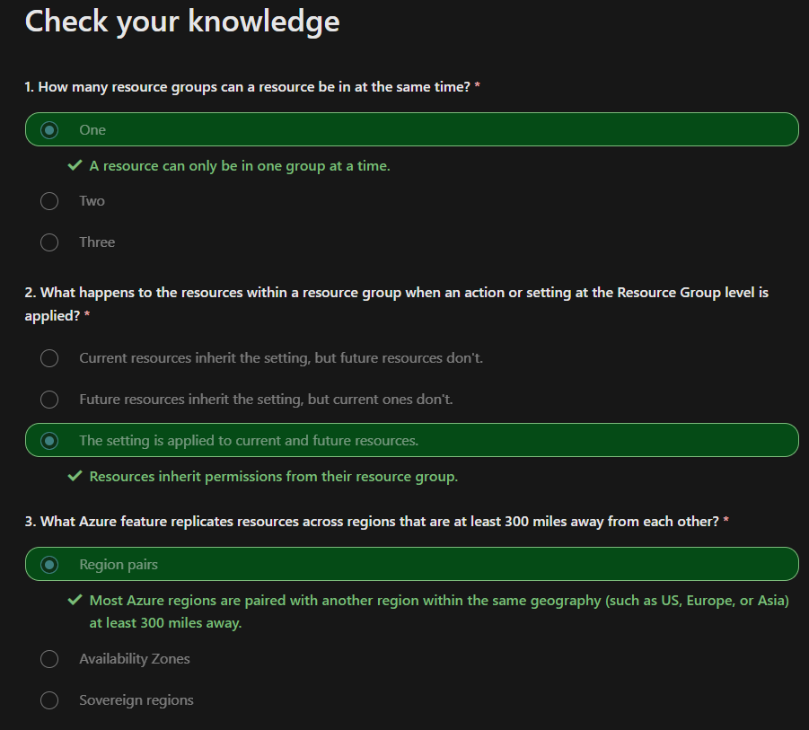
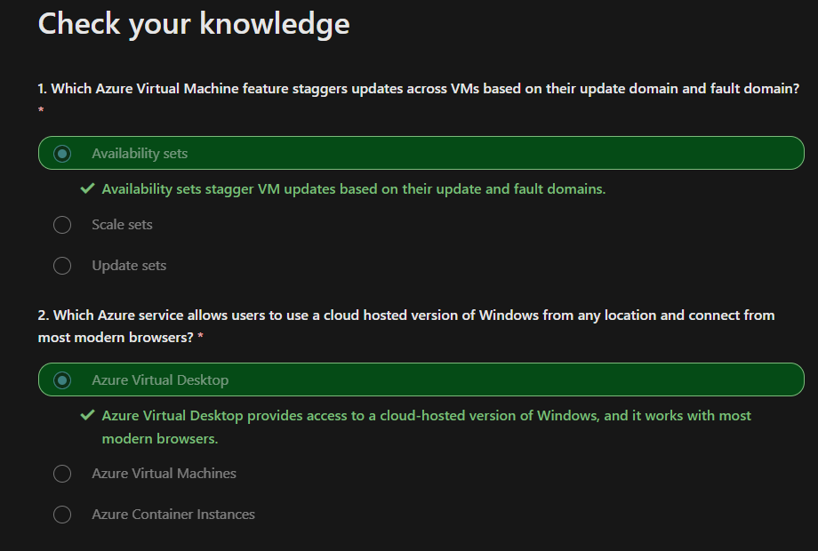

Notes and Resources for the AZ-900 certification.

# [Describe cloud concepts](https://learn.microsoft.com/en-us/training/paths/microsoft-azure-fundamentals-describe-cloud-concepts/)


## Describe cloud computing


### What is cloud computing?

Cloud computing is the delivery of computing services over the internet.


### What is the shared responsibility model

Customers are always responsible for:
- The information and data stored in the cloud
- Devices that are allowed to connect to your cloud
- The accounts and identities of the people, services, and devices within your organization

The cloud provider is always responsible for:
- The physical datacenter
- The physical network
- The physical hosts

Your service model will determine responsibility for things like:
- Operating systems
- Network controls
- Applications

This depends on the Type of Service:

|Type|Client Responsibility|
|-|-|
|**S**oftware **a**s **a** **S**ervice|Less|
|**P**latform **a**s **a** **S**ervice|Neutral|
|**I**nfrastructure **a**s **a** **S**ervice|More|


### Define cloud models


|Public cloud|Private cloud|Hybrid cloud|
|-|-|-|
No capital expenditures to scale up|Organizations have complete control over resources and security|Provides the most flexibility|
Applications can be quickly provisioned and deprovisioned|	Data is not collocated with other organizations’ data|	Organizations determine where to run their applications|
Organizations pay only for what they use|	Hardware must be purchased for startup and maintenance|	Organizations control security, compliance, or legal requirements|
Organizations don’t have complete control over resources and security|	Organizations are responsible for hardware maintenance and updates||

Multi-cloud:
- Multiple public cloud providers

Azure Arc:
- Set of technologies that helps manage the cloud environment.

Azure VMware Solution:
- Run your VMWare workloads in Azure


### Consumption based model
Capital Expenditure(CapEx):
- Typically one-time up-front payment
- E.g new datacenter

Operational Expenditure(OpEx):
- Spending money on services over time
- Leasing a company vehicle

Consumption-based model is OpEx

This consumption-based model has many benefits, including:

No upfront costs.
- No need to purchase and manage costly infrastructure that users might not use to its fullest potential.
- The ability to pay for more resources when they're needed.
- The ability to stop paying for resources that are no longer needed.

You typically pay only for the cloud services you use, which helps you:

- Plan and manage your operating costs.
- Run your infrastructure more efficiently.
- Scale as your business needs change.


## Describe the benefits of using cloud services

### High availability and scalability

#### Availability
- focuses on ensuring maximum availability
- Azure is highly available cloud environment
- Service Level Agreements define the availability

|Uptime|per Week|per Month|
|-|-|-|
|99%|1.6h|7.2h|
|99.9%|10min|43min|

--> SLAs should be selected accordingly

#### Scalability
Ability to adjust resources to meet demand. 
- Adding resources to match increasing demand
- No overpaying for services

**Vertical Scaling**
- scaling up by increasing the resources quality -> e.g more CPU or RAM
- scaling down by decreasing the resources quality

**Horizontal Scaling**
- scaling out -> Adding resources (More servers)
- scaling in -> Removing resources (Less servers)
- One can scale horizontally by simply increasing the number of resources

Scaling can happen manually or automatically to match demand.

### Benefits of reliability and predictability in the cloud

#### Reliability
- Ability to recover from failures and continue to function.
- The clouds decentralized design enables reliable and resilient infrastructure.
- Global scale helps in catastrophic events

#### Predictability 
Performance predictability and cost predictability helps building confidence

**Performance**
- Performance predictability focuses on predicting the resources needed to deliver a positive experience for your customers.
- Cloud features like Autoscaling, load balancing, high availability lead to performance predictability

**Cost**
- Cost predictability is focused on predicting or forecasting the cost of the cloud spend
- Real time tracking, Data Analysis, Total Cost of Ownership, Pricing Calculator

### Security and governance
**Governance and compliance**
- Cloud based auditing
- Templates
- Automatic Updates

**Security**
- Maximum control via IaaS
- Well suited to handle things like distributed denial of service (DDoS) attacks

### Manageability
Two types:

#### Management of the cloud
Management of the cloud speaks to managing your cloud resources. In the cloud, you can:
- Automatically scale resource deployment based on need.
- Deploy resources based on a preconfigured template, removing the need for manual configuration.
- Monitor the health of resources and automatically replace failing resources.
- Receive automatic alerts based on configured metrics, so you’re aware of performance in real time.

#### Management in the cloud
Management in the cloud speaks to how you’re able to manage your cloud environment and resources. You can manage these:

- Through a web portal.
- Using a command line interface.
- Using APIs.
- Using PowerShell.

## Cloud service Types

### Infrastructure as a Service

Infrastructure as a service (IaaS) is the most flexible category of cloud services, as it provides you the maximum amount of control for your cloud resources.

Refer to the shared responsibility model.

Some common scenarios where IaaS might make sense include:

- Lift-and-shift migration: You’re setting up cloud resources similar to your on-prem datacenter, and then simply moving the things running on-prem to running on the IaaS infrastructure.
- Testing and development: You have established configurations for development and test environments that you need to rapidly replicate. You can start up or shut down the different environments rapidly with an IaaS structure, while maintaining complete control.

### Platform as a Service
Platform as a service (PaaS) is a middle ground between renting space in a datacenter (infrastructure as a service) and paying for a complete and deployed solution (software as a service).
Refer to the shared responsibility model.

Some common scenarios where PaaS might make sense include:

- Development framework: PaaS provides a framework that developers can build upon to develop or customize cloud-based applications. Similar to the way you create an Excel macro, PaaS lets developers create applications using built-in software components. Cloud features such as scalability, high-availability, and multi-tenant capability are included, reducing the amount of coding that developers must do.
- Analytics or business intelligence: Tools provided as a service with PaaS allow organizations to analyze and mine their data, finding insights and patterns and predicting outcomes to improve forecasting, product design decisions, investment returns, and other business decisions.

### Software as a Service
Software as a service (SaaS) is the most complete cloud service model from a product perspective. With SaaS, you’re essentially renting or using a fully developed application. 

Some common scenarios for SaaS are:

- Email and messaging.
- Business productivity applications.
- Finance and expense tracking.

# [Describe Azure architecture and services](https://learn.microsoft.com/en-us/training/paths/azure-fundamentals-describe-azure-architecture-services/)
## Core architectural components of Azure
### What is MS Azure

Azure is Microsoft's cloud computing platform, a continually expanding set of cloud services that help you meet current and future business challenges.
- most services are pay as you go
- Azure provides IaaS, PaaS and SaaS
- Storage, VMs, Cloud Functions, Containerization, CosmosDB, Azure Machine Learning, Regional Datacenters
- AzurePortal for Resource Management

### Azure accounts 
To create and use Azure services, you need an Azure subscription.

If you're new to Azure, you can sign up for a free account on the Azure website to start exploring at no cost to you.

**Free Account**
The [Azure free account](https://azure.microsoft.com/free) includes:
- Free access to popular Azure products for 12months
- A credit to use for the first 30 days.
- Access to more than 25 products that are always free

**Learn Sandbox**
Many of the Learn exercises use a technology called the sandbox, which creates a temporary subscription that's added to your Azure account. 

### Explore the Learn Sandbox

Commands:

|Command|Result|
|-|-|
|az version|shows the version of the cli you are using|
|bash|switches to bash mode |
|az interactive|switches to interactive mode|
|az upgrade| upgrades the cli|

### Describe Azure physical infrastructure
#### Physical
Microsoft is providing Azure via multiple datacenters all around the world. 

The resources in the facilities are arranged in racks and have dedicated power, cooling and networking.

Datacenters are grouped into Azure Regions or Azure Availability zones that are designed to help you achieve resiliency and reliability for your business-critical workloads.

[Explore the physical infrastructure](https://datacenters.microsoft.com/globe/explore)

#### Region

A region is a geographical area on the planet that contains at least one, but potentially multiple datacenters that are nearby and networked together with a low-latency network. 

When you deploy a resource in Azure, you'll often need to choose the region where you want your resource deployed.

#### Availability Zones
Availability zones are physically separate datacenters within an Azure region. 

Each availability zone is made up of one or more datacenters equipped with independent power, cooling, and networking. An availability zone is set up to be an isolation boundary. If one zone goes down, the other continues working.


**To ensure resiliency, a minimum of three separate availability zones are present in all availability zone-enabled regions. However, not all Azure Regions currently support availability zones.**

Setting up own on premise redundancy requires duplicate hardware

Availability zones are primarily for VMs, managed disks, load balancers, and SQL databases. Azure services that support availability zones fall into three categories:

- Zonal services: You pin the resource to a specific zone (for example, VMs, managed disks, IP addresses).
- Zone-redundant services: The platform replicates automatically across zones (for example, zone-redundant storage, SQL Database).
- Non-regional services: Services are always available from Azure geographies and are resilient to zone-wide outages as well as region-wide outages.

Even with the additional resiliency that availability zones provide, it’s possible that an event could be so large that it impacts multiple availability zones in a single region. To provide even further resilience, Azure has Region Pairs.

#### Region Pairs
Most Azure regions are paired with another region within the same geography (such as US, Europe, or Asia) at least 300 miles away.


>Not all Azure services automatically replicate data or automatically fall back from a failed region to cross-replicate to another enabled region. In these scenarios, recovery and replication must be configured by the customer.Most regions are paired in two directions but one way pairing is possible.

Additional advantages:
- If an extensive Azure outage occurs, one region out of every pair is prioritized to make sure at least one is restored as quickly as possible for applications hosted in that region pair.
- Planned Azure updates are rolled out to paired regions one region at a time to minimize downtime and risk of application outage.
- Data continues to reside within the same geography as its pair (except for Brazil South) for tax- and law-enforcement jurisdiction purposes.

#### Sovereign Regions
Sovereign regions are instances of Azure that are isolated from the main instance of Azure. 

- US DoD Central, US Gov Virginia, US Gov Iowa and more: These regions are physical and logical network-isolated instances of Azure for U.S. government agencies and partners. These datacenters are operated by screened U.S. personnel and include additional compliance certifications.
- China East, China North, and more: These regions are available through a unique partnership between Microsoft and 21Vianet, whereby Microsoft doesn't directly maintain the datacenters.

### Describe Azure management infrastructure
#### Resource
A resource is the basic building block of Azure
- Anything you create, deploy, provision etc.
- E.g VMs, virtual networks, databases, cognitive services

#### Resource groups
Groupings of resources. 

- Resources have to be added to a resource group. 
- A single resource can only be in one resource group at a time
- Resource groups cant be nested

Resource groups provide a convenient way to group resources together.
- Applying an action to a group will apply the action to all the resources 

When you’re provisioning resources, it’s good to think about the resource group structure that best suits your needs.

There aren’t hard rules about how you use resource groups, so consider how to set up your resource groups to maximize their usefulness for you.

#### Azure subscriptions


**Using Azure requires an Azure subscription.**

Subscriptions are a unit of management, billing, and scale.

An Azure subscription links to an Azure account, which is an identity in Microsoft Entra ID or in a directory that Microsoft Entra ID trusts.

An account can have multiple subscriptions, but it’s only required to have one. In a multi-subscription account, you can use the subscriptions to configure different billing models and apply different access-management policies.

Azure subscriptions can be used to define boundaries:
- Billing boundary: 
This subscription type determines how an Azure account dis billed for using Azure. Separate billing reports and invoices are being generated for each subscription.
- Access control boundary: 
Azure applies access-management policies at the subscription level. You can create separate subscriptions to reflect organizational structures.

**Create additional Azure subscriptions**
With additional subscriptions you can separate:
- Environments
- Organizational structures
- Billing

#### Azure management groups
This is the scope above subscriptions.
Can be used to manage subscriptions accounting for access, policies and compliance.


Important facts about management groups:

- 10,000 management groups can be supported in a single directory.
- A management group tree can support up to six levels of depth. This limit doesn't include the root level or the subscription level.
- Each management group and subscription can support only one parent.

### Exercise Create an Azure resource
[created a ressource](https://learn.microsoft.com/en-us/training/modules/describe-core-architectural-components-of-azure/7-exercise-create-azure-resource)
### Knowledge check

## Azure compute and networking services
### Virtual Machines
**Use Cases:**
  - Full control over OS.
  - Run custom software.
  - Custom hosting configurations.
  - Rapid VM provisioning with preconfigured images.

**Scaling:**
  - Run single or grouped VMs.
  - Scale sets: manage identical, load-balanced VMs.
  - Availability sets: ensure high availability and resilience.

**Virtual Machine Scale Sets:**
  - Automate configuration, scaling, and updates.
  - Adjust VM instances based on demand.
  - Load balancing included.

**Virtual Machine Availability Sets:**
  - Ensure varied updates and power/network connectivity.
  - Group VMs by update and fault domains.
  - No additional cost for configuring.

**Common Examples:**
  - Testing and development.
  - Running cloud applications.
  - Extending datacenter to the cloud.
  - Disaster recovery.

**Move to the Cloud:**
  - Lift and shift physical servers to VMs.
  - Maintain VM OS and software.

**Resource Selection:**
  - Size (cores, RAM).
  - Storage disks.
  - Networking (virtual network, public IP, ports).

### Exercise Create an Azure virtual machine
[link](https://learn.microsoft.com/en-us/training/modules/describe-azure-compute-networking-services/3-exercise-create-azure-virtual-machine)

```
Create LinuxVM:
az vm create \
  --resource-group "learn-f05739ba-066e-4e65-984b-a7ac1d4ef706" \
  --name my-vm \
  --public-ip-sku Standard \
  --image Ubuntu2204 \
  --admin-username azureuser \
  --generate-ssh-keys   
```

```
Configure Nginx:
az vm extension set \
  --resource-group "learn-f05739ba-066e-4e65-984b-a7ac1d4ef706" \
  --vm-name my-vm \
  --name customScript \
  --publisher Microsoft.Azure.Extensions \
  --version 2.1 \
  --settings '{"fileUris":["https://raw.githubusercontent.com/MicrosoftDocs/mslearn-welcome-to-azure/master/configure-nginx.sh"]}' \
  --protected-settings '{"commandToExecute": "./configure-nginx.sh"}'    
```
### Azure Virtual Desktop
**Overview:**
  - Desktop and application virtualization service on the cloud.
  - Access cloud-hosted Windows from any location.
  - Compatible with various devices, operating systems, and modern browsers.

**Security:**
  - Centralized security management with Microsoft Entra ID.
  - Multifactor authentication for secure sign-ins.
  - Granular role-based access controls (RBACs).
  - Data and apps run in the cloud, reducing the risk of data on personal devices.
  - Isolated user sessions in both single and multi-session environments.

**Multi-Session Windows Deployment:**
  - Use Windows 10 or Windows 11 Enterprise multi-session.
  - Multiple concurrent users on a single VM.
  - Consistent experience with broader application support compared to Windows Server-based OS.

### Azure Containers
TODO: Link to containerization
- **Containers:**
  - Virtualization environment for running multiple instances on a single host.
  - No need to manage the operating system.
  - Lightweight, agile, and designed for dynamic scaling.
  - Quick to restart after crashes or interruptions.
  - Popular container engine: Docker (supported by Azure).

**Azure Container Instances:**
  - Fastest and simplest way to run a container in Azure.
  - No need to manage virtual machines or additional services.
  - Platform as a service (PaaS) offering.
  - Upload and run containers easily.

**Azure Container Apps:**
  - Similar to container instances with added benefits.
  - Load balancing and scaling capabilities.
  - More elastic design.

**Azure Kubernetes Service (AKS):**
  - Container orchestration service.
  - Manages the lifecycle of containers.
  - Simplifies management of a fleet of containers.

**Use Containers in Solutions:**
  - Often used in microservice architecture.
  - Break solutions into smaller, independent pieces.
  - Example: Split a website into separate containers for front end, back end, and storage.
  - Allows independent scaling, maintenance, and updates.
  - Scale specific parts (e.g., back end) as needed without affecting others.

### Azure Functions
TODO: Link to serverless approach

**Overview:**
  - Event-driven, serverless compute option.
  - No need to maintain virtual machines or containers.
  - Functions are triggered by events, eliminating the need for always-on resources.

**Benefits of Azure Functions:**
  - Focus on code, not the underlying infrastructure.
  - Ideal for quick tasks triggered by events, timers, or messages from other services.
  - Automatically scales based on demand.
  - Only charged for CPU time used while functions run. (Event driven)
  - Supports stateless (default) and stateful (Durable Functions) modes.
  - Stateless: Functions restart with each event.
  - Stateful: Track activity with context passed through functions.
  - General compute platform for any type of code.
  - Flexible deployment options: serverless, virtual networks, or isolated environments.

### Application hosting options

**Virtual Machines (VMs):**
  - Maximum control over the hosting environment.
  - Familiar hosting method for those new to the cloud.

**Containers:**
  - Isolate and manage different aspects of the hosting solution.
  - Robust and flexible hosting option.

**Azure App Service:**

  - **Overview:**
    - Build and host web apps, background jobs, mobile back-ends, and RESTful APIs.
    - No need to manage infrastructure.
    - Automatic scaling and high availability.
    - Supports Windows and Linux.
    - Automated deployments from GitHub, Azure DevOps, or any Git repo.
    - Focus on app development while Azure manages the environment.

  - **Supported Languages:**
    - .NET, .NET Core, Java, Ruby, Node.js, PHP, Python.
    - Supports both Windows and Linux environments.

  - **Types of App Services:**
    - **Web Apps:**
      - Full support for hosting using various languages.
      - Choice of Windows or Linux as the host OS.
    - **API Apps:**
      - Build REST-based web APIs.
      - Full Swagger support.
      - Package and publish APIs in Azure Marketplace.
      - Consumable by any HTTP- or HTTPS-based client.
    - **WebJobs:**
      - Run programs or scripts in the same context as web, API, or mobile apps.
      - Scheduled or triggered runs.
      - Ideal for background tasks.
    - **Mobile Apps:**
      - Quickly build back ends for iOS and Android apps.
      - Store data in cloud-based SQL database.
      - Authenticate customers with social providers (MSA, Google, Twitter, Facebook).
      - Send push notifications.
      - Execute custom back-end logic.
      - SDK support for native iOS, Android, Xamarin, and React native apps.

**Infrastructure Management:**
    - Integrated deployment and management.
    - Secured endpoints.
    - Quick scaling to handle high traffic.
    - Built-in load balancing and traffic management for high availability.
    - Shared infrastructure benefits for all app styles.

**Azure App Service Benefits:**
  - Ideal for hosting web-oriented applications.
  - Flexible and scalable hosting option.

### Azure virtual networks and subnets
**Overview:**
  - Enable Azure resources (VMs, web apps, databases) to communicate with each other, the internet, and on-premises client computers.
  - Act as an extension of on-premises networks.

**Key Networking Capabilities:**
  - **Isolation and Segmentation:**
    - Create multiple isolated virtual networks.
    - Define private IP address spaces (public/private IP ranges).
    - Subdivide address spaces into named subnets.
    - Built-in name resolution service or use internal/external DNS servers.
  - **Internet Communications:**
    - Incoming connections via public IP addresses or public load balancers.
  - **Communicate Between Azure Resources:**
    - Connect VMs and other Azure resources (App Service Environment, Azure Kubernetes Service, Azure VM scale sets).
    - Use service endpoints to link Azure resources like SQL databases and storage accounts for improved security and routing.
  - **Communicate with On-Premises Resources:**
    - **Point-to-Site VPN:**
      - Computer outside organization to corporate network (encrypted VPN connection).
    - **Site-to-Site VPN:**
      - On-premises VPN device/gateway to Azure VPN gateway (encrypted connection over the internet).
    - **Azure ExpressRoute:**
      - Dedicated private connectivity to Azure, bypassing the internet (higher bandwidth and security).
  - **Route Network Traffic:**
    - Default traffic routing between subnets, virtual networks, on-premises networks, and the internet.
    - Custom route tables and Border Gateway Protocol (BGP) for custom routing.
  - **Filter Network Traffic:**
    - **Network Security Groups (NSGs):**
      - Define rules to allow/block traffic based on IP address, port, and protocol.
    - **Network Virtual Appliances (NVAs):**
      - Specialized VMs for specific network functions (firewalls, WAN optimization).
  - **Connect Virtual Networks:**
    - **Virtual Network Peering:**
      - Connect two virtual networks privately over the Microsoft backbone network.
      - Enables inter-region communication for a global interconnected network.
    - **User-Defined Routes (UDRs):**
      - Control routing tables between subnets/virtual networks for greater traffic flow control.

**Endpoint Types:**
- **Public Endpoints:**
  - Public IP addresses accessible worldwide.
- **Private Endpoints:**
  - Private IP addresses within a virtual network's address space.

#### Exercise: Configure network access
[Link](https://learn.microsoft.com/en-us/training/modules/describe-azure-compute-networking-services/9-exercise-configure-network-access)
### Exercise - Configure Network Access

**Overview:**
- Configure access to a previously created VM.
- Ensure the VM is running with `az vm list`.

**Tasks:**

1. **Access Your Web Server:**
   - Get the VM's IP address:
     ```bash
     IPADDRESS="$(az vm list-ip-addresses --resource-group "learn-f05739ba-066e-4e65-984b-a7ac1d4ef706" --name my-vm --query "[].virtualMachine.network.publicIpAddresses[*].ipAddress" --output tsv)"
     ```
   - Test connection to the web server:
     ```bash
     curl --connect-timeout 5 http://$IPADDRESS
     ```
   - If the connection times out, print the IP address:
     ```bash
     echo $IPADDRESS
     ```
   - Attempt to access the web server from a browser.

2. **List Current network security group Rules:**
   - List the NSGs associated with the VM:
     ```bash
     az network nsg list --resource-group "learn-f05739ba-066e-4e65-984b-a7ac1d4ef706" --query '[].name' --output tsv
     ```
   - List the rules in the NSG:
     ```bash
     az network nsg rule list --resource-group "learn-f05739ba-066e-4e65-984b-a7ac1d4ef706" --nsg-name my-vmNSG --query '[].{Name:name, Priority:priority, Port:destinationPortRange, Access:access}' --output table
     ```

3. **Create Network Security Rule:**
   - Create a rule to allow inbound HTTP access on port 80:
     ```bash
     az network nsg rule create --resource-group "learn-f05739ba-066e-4e65-984b-a7ac1d4ef706" --nsg-name my-vmNSG --name allow-http --protocol tcp --priority 100 --destination-port-range 80 --access Allow
     ```
   - Verify the new rule:
     ```bash
     az network nsg rule list --resource-group "learn-f05739ba-066e-4e65-984b-a7ac1d4ef706" --nsg-name my-vmNSG --query '[].{Name:name, Priority:priority, Port:destinationPortRange, Access:access}' --output table
     ```

4. **Access Your Web Server Again:**
   - Retry accessing the web server:
     ```bash
     curl --connect-timeout 5 http://$IPADDRESS
     ```

**Optional Steps:**
- Refresh your browser to check the web server's home page.

**Clean Up:**
- The sandbox automatically cleans up resources after the module.
- For your own subscription, delete unnecessary resources to avoid costs.

**Next Unit:**
- Describe Azure Virtual Private Networks.

### Virtual Private Network (VPN)

**Overview:**
- Encrypted tunnel within a network for secure communication.
- Typically connects trusted private networks over an untrusted network (e.g., public internet).

**VPN Gateways:**
- Type of virtual network gateway in Azure.
- Enables various connectivity options:
  - Site-to-site connection to on-premises datacenters.
  - Point-to-site connection for individual devices.
  - Network-to-network connection between virtual networks.
- Data transfer encrypted within private tunnels.
- Only one VPN gateway per virtual network.
- Authentication method: pre-shared key.

**Policy-based vs. Route-based VPN:**
- Policy-based: Specifies IP addresses for encryption.
- Route-based: Tunnels modeled as network interfaces, preferred for on-premises devices.

**High Availability:**
- **Active/Standby:** Default configuration with automatic failover.
- **Active/Active:** Support for BGP routing protocol, assigns unique IP addresses.
- **ExpressRoute Failover:** VPN gateway as a failover path for ExpressRoute connections.
- **Zone-Redundant Gateways:** Deployed in Azure availability zones for resiliency.

### Azure ExpressRoute

**Overview:**
- Extends on-premises networks to Microsoft cloud via private connection, direct connection, no traffic over public internet
- Connection facilitated through ExpressRoute Circuit.
- Direct access to Microsoft cloud services like Azure and Microsoft 365.

**Connectivity Options:**
- Any-to-any (IP VPN), point-to-point Ethernet, or virtual cross-connection.
- Connections bypass public internet for enhanced reliability, speed, latency, and security.

**Features and Benefits:**
- **Connectivity to Microsoft Cloud:**
  - Access to various Microsoft services across all regions.
  - Global connectivity with ExpressRoute Global Reach.
- **Dynamic Routing:**
  - Utilizes Border Gateway Protocol (BGP) for route exchange.
- **Built-in Redundancy:**
  - Redundant devices at peering locations for reliability.

**Connectivity Models:**
1. **CloudExchange Colocation:**
   - Co-located at cloud exchange, request virtual cross-connect.
2. **Point-to-Point Ethernet Connection:**
   - Direct point-to-point connection to Microsoft cloud.
3. **Any-to-Any Networks:**
   - Integrates WAN with Azure for office and datacenter connections.
4. **Directly from ExpressRoute Sites:**
   - Connects directly to Microsoft's global network at peering locations.

**Security Considerations:**
- Data doesn't traverse public internet, enhancing security.
- Private connection from on-premises to Azure.
- Some communications (e.g., DNS queries) still go over public internet.

### Azure DNS

**Overview:**
- Hosting service for DNS domains using Microsoft Azure infrastructure.
- Manages DNS records with Azure credentials, APIs, tools, and billing.

**Benefits:**
1. **Reliability and Performance:**
   - Hosted on Azure's global network of DNS name servers.
   - Anycast networking for fast performance and high availability.
2. **Security:**
   - Utilizes Azure Resource Manager features like role-based access control and activity logs.
   - Resource locking to prevent accidental deletion or modification of critical resources.
3. **Ease of Use:**
   - Integrated into Azure portal with consistent credentials, support, and billing.
   - Management via Azure portal, PowerShell cmdlets, Azure CLI, REST API, and SDKs.
4. **Customizable Virtual Networks:**
   - Supports private DNS domains for custom domain names in private virtual networks.
5. **Alias Records:**
   - Supports alias record sets to refer to Azure resources like public IP addresses, Traffic Manager profiles, or CDN endpoints.
   - Automatically updates during DNS resolution if underlying resource IP address changes.

**Important Note:**
- Azure DNS does not provide domain name purchasing; use App Service domains or third-party registrars for domain name acquisition.
### Knowlede check

### Additional resources
Additional resources
The following additional resources are intended to provide more information on topics in this module or on additional topics related to this module.

- [Host a web application with Azure App Service](https://learn.microsoft.com/en-us/learn/modules/host-a-web-app-with-azure-app-service/) is a Microsoft Learn module that explores the process of hosting a web application in Azure.
- [Introduction to Azure network foundation services](https://learn.microsoft.com/en-us/learn/paths/intro-to-azure-network-foundation-services/) is a Microsoft Learn course that provides greater insight and information on networking with Azure.
## Azure storage services
## Azure identity access and security
# [Describe Azure management and governance](https://learn.microsoft.com/en-us/training/paths/describe-azure-management-governance/)
## Cost management in Azure
## Features and Tools in Azure for governance and compliance
## Features and tools for managing and deploying Azure resources
## Monitoring tools
